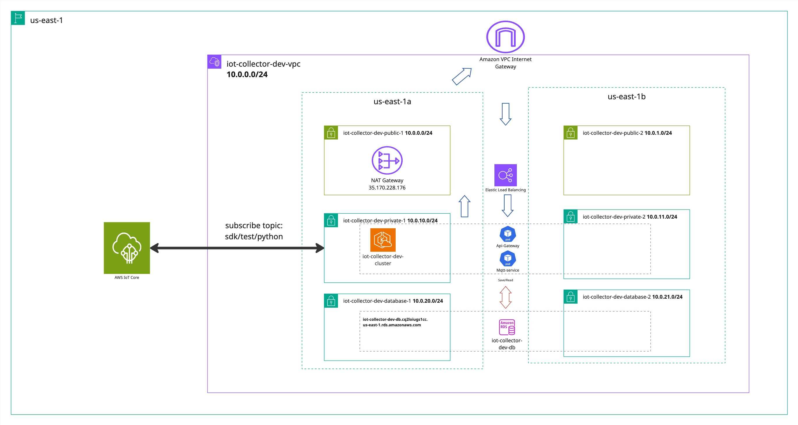

# IoT Data Collector System

# Overview
This project implements a scalable, secure microservice-based IoT Data Collector System that integrates with AWS cloud services. The system collects data from IoT devices via MQTT protocol, stores it in a database, and provides monitoring and observability capabilities.

# Architecture diagrams

## Overview
This diagram illustrates the **AWS network architecture** of the `iot-collector-dev` environment deployed in the `us-east-1` region. The infrastructure is built to collect, process, and store IoT data using AWS IoT Core, Amazon EKS, and Amazon RDS PostgreSQL.

---
## VPC Layout
- **VPC CIDR:** `10.0.0.0/16`
- **Region:** `us-east-1`
- **Availability Zones:**
  - `us-east-1a`
  - `us-east-1b`
---

## 🌐 Subnets & NAT
| Subnet Name                  | CIDR Block     | AZ         | Purpose                        |
|-----------------------------|----------------|------------|--------------------------------|
| `iot-collector-dev-public-1`  | `10.0.0.0/24`   | us-east-1a | NAT Gateway                    |
| `iot-collector-dev-public-2`  | `10.0.1.0/24`   | us-east-1b | Reserved for HA NAT            |
| `iot-collector-dev-private-1` | `10.0.10.0/24`  | us-east-1a | EKS cluster and services       |
| `iot-collector-dev-private-2` | `10.0.11.0/24`  | us-east-1b | EKS node group                 |
| `iot-collector-dev-database-1`| `10.0.20.0/24`  | us-east-1a | RDS PostgreSQL                 |
| `iot-collector-dev-database-2`| `10.0.21.0/24`  | us-east-1b | RDS PostgreSQL                 |
- **NAT Gateway:** Deployed in `public-1` (AZ `us-east-1a`)
- **Elastic IP:** `35.170.228.176`

---

##  Key Components
### AWS IoT Core
- Receives messages from IoT devices
- Subscribed topic:  
  sdk/test/python
### Amazon EKS
- Deployed in private subnets `10.0.10.0/24`, `10.0.11.0/24` (AZ `us-east-1a`, `us-east-1b`) with no public IPs
- Manages containerized services:
#### `Api-Gateway` with endpoints for health checks, device management, and data retrieval
- `GET /health` – Health check endpoint to verify that the API Gateway service is running properly.  
- `GET /api/devices` – Retrieves a list of all devices that have sent data to the system.  
- `GET /api/devices/{deviceId}/data` – Retrieves time-series data for a specific device with optional query parameters (`limit`, `from`, `to`).  
- `GET /api/stats` – Provides statistics about the collected IoT data (device count, message count, etc.).  
#### `MQTT-Service` (subscriber)
- Connects to RDS to **save** IoT data

### Amazon RDS PostgreSQL
- Multi-AZ deployment across `10.0.20.0/24` and `10.0.21.0/24`
- Endpoint:  
- Port: `5432`
- Secured to allow access only from EKS nodes

# Step-by-step deployment guide

# Security

## Security Notes

- Private and database subnets have **no public IPs**.
- NAT Gateway allows outbound internet access from private subnets.
- RDS security group only accepts traffic from EKS worker nodes on port `5432`.
- IoT communication is secured using AWS IoT policies in written in terraform and certificates stored in EKS secrets.

## Security Considerations

- **Network Security**: All services are deployed within private subnets with controlled access through security groups
- **Authentication**: MQTT broker requires client authentication
- **Authorization**: IAM roles for service-to-service communication
- **Data Encryption**: TLS for in-transit encryption, KMS for at-rest encryption
- **Secrets Management**: AWS Secrets Manager for credentials

## Monitoring and Observability

# Monitoring

- **Metrics Collection**: All services expose metrics via `/metrics` endpoint
- **Prometheus**: Scrapes metrics from services
- **Grafana Dashboards**:
  - MQTT message rate
  - Database write operations
  - System resource utilization
  - API response times

# AWS cost estimates

## Assumptions for Using AWS Infrastructure
- **AWS IoT Core**: Connects 5 devices sending small messages (0.5 KB) every 5 minutes.  
- **ECR**: Stores our Docker images for easy deployment.  
---

## Estimated Traffic (Per Month)
- **IoT → AWS**: ~22 MB  
- **Internal forwarding (IoT → MQTT → DB)**: ~75 MB  
- **User API calls**: ~4 MB  
The setup is low-cost, scalable, and ready for real-world testing.

---

## Monthly Cost Breakdown (USD)

| **Component**                  | **Estimated Monthly Cost (USD)** | **Notes**                                                  |
|-------------------------------|----------------------------------|------------------------------------------------------------|
| NAT Gateway (hourly)          | 32.40                            | Hourly charge                                              |
| NAT Gateway (data)            | 0.45                             | Charge for processing 10 GB of data                        |
| EKS Cluster                   | 72.00                            | Hourly charge for the cluster                              |
| EC2 (2 × t3.medium)           | 59.90                            | Hourly charge for worker nodes                             |
| RDS DB Instance (db.t3.micro) | 11.52                            | Hourly charge                                              |
| RDS Storage (20 GB)           | 2.00                             | Monthly charge for EBS                                     |
| IoT Core Connectivity         | 0.02                             | 5 devices, running 24/7                                    |
| IoT Core Messaging            | 0.04                             | 43,200 messages                                            |
| IoT Core Rules Triggered      | 0.01                             | 43,200 rule executions                                     |
| IoT Core Actions Executed     | 0.01                             | 43,200 actions executed                                    |
| ECR Storage (10 GB)           | 1.00                             | Monthly charge                                             |
| API Gateway Requests          | <0.01                            | 400 requests/month                                         |
| API Gateway Data Out          | 0.35                             | 4 MB of data transfer                                      |
| **TOTAL**                     | **~179.70**                      | Excluding taxes and discounts                              |

---

## Optimized AWS Architecture Proposal
For a **small-scale IoT development or test environment**, you can significantly reduce costs with these changes:
- **Replace EKS** with **ECS Fargate**, which is easier to manage and **much cheaper** for small workloads.  
- Use only **one t3.small EC2 instance** (or even t3.micro) for any compute needs, instead of two t3.mediums.  
- **Remove the NAT Gateway** and use **VPC Endpoints** or **public subnets** with strict security groups.  
